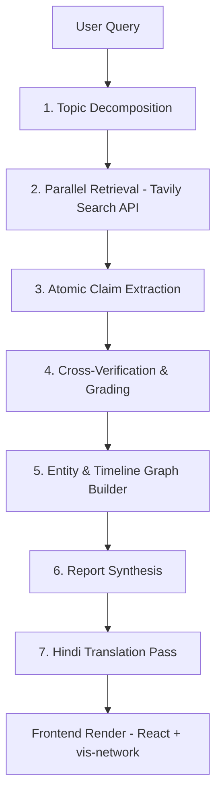

<<<<<<< HEAD
# veritas
=======
# ⚖️ Veritas — Deep Research & Claim-Verification Engine

> **Multi-source, evidence-graded research engine for Indian socio-political topics.**

Veritas decomposes complex socio-political queries into checkable sub-questions, retrieves multi-outlet evidence, extracts atomic factual claims, cross-verifies them against disconfirming sources, and generates evidence-graded reports with entity/timeline graph visualizations — **with no verdict before evidence**.

---

## 📸 Screenshots

| Dashboard & Stage Tracker | Extracted Claims & Verification |
|---|---|
|  |  |

| Timeline View | Interactive Entity Graph |
|---|---|
|  |  |

---

## 🌟 Key Features & Design Principles

1. **No Verdict Before Evidence**: Conclusions are strictly an output of cross-verified evidence, never hardcoded as pipeline instructions.
2. **Claims vs. Facts vs. Opinions**: Discrete objects in the data model. Every claim carries source attribution, outlet stance, and a calculated grade.
3. **Multi-Outlet Triangulation**: Cross-verifies claims across differing editorial leans (left, centre, right, international).
4. **Active Disconfirm Search**: Automatically searches for disconfirming sources (`-site:outlet`) to test each claim. Absence of disconfirming sources is explicitly noted and never treated as default confirmation.
5. **Entity Scope Limit**: Profiles public figures and organizations on-record only. Private citizens are strictly excluded.
6. **No Motive Attribution**: Reports on-record actions and statements only; never infers psychological intent or unevidenced ambition.
7. **Multi-Language Support**: English base reasoning with a final-pass Hindi translation layer.

---

## 🏗️ Pipeline Architecture



### Pipeline Stages

| Stage | Name | Description | Default Model |
|---|---|---|---|
| **1** | **Decomposition** | Breaks query into 6 checkable sub-questions | `llama-3.1-8b-instant` |
| **2** | **Retrieval** | Tavily search fan-out across multiple outlets | External API |
| **3** | **Extraction** | Extracts atomic claims with source & stance tagging | `llama-3.1-8b-instant` |
| **4** | **Verification** | Disconfirm search + lean diversity check + grading | `llama-3.1-8b-instant` |
| **5** | **Graph Builder** | Extracts public entities & timeline events with claim links | `llama-3.1-8b-instant` |
| **6** | **Synthesis** | Evidence-only summary & verdict generation | `llama-3.3-70b-versatile` |
| **7** | **Translation** | Final-pass Hindi translation of report sections | `llama-3.1-8b-instant` |

---

## 🏷️ Claim Grading Matrix

- 🟢 **Confirmed**: Corroborated as fact by $\ge 2$ independent outlets across diverse editorial leans (e.g. Left + Right, or International).
- 🟡 **Disputed**: Outlets explicitly contradict each other regarding the claim.
- ⚪ **Unverified**: Reported by a single outlet, or only outlets of the same editorial lean, or no corroboration found.
- 🟣 **Opinion**: Source explicitly frames the statement as editorial analysis or personal commentary.

---

## 🛠️ Tech Stack

- **Orchestration**: LangGraph (Python) `StateGraph`
- **Backend API**: FastAPI + Server-Sent Events (SSE) streaming
- **Primary LLM**: Groq (Llama 3.3 70B & Llama 3.1 8B Instant)
- **Fallback LLM**: Google GenAI SDK (Gemini 2.5 Flash / Gemini 1.5 Flash / Gemini 2.0 Flash)
- **Search Provider**: Tavily Search API
- **Frontend**: React 18 + Vite + `vis-network` (interactive entity graph) + Custom Dark Design System

---

## 🚀 Getting Started

### Prerequisites

- **Python**: 3.10 or higher
- **Node.js**: v18 or higher
- **API Keys**:
  - [Groq API Key](https://console.groq.com) (Free Tier)
  - [Tavily API Key](https://tavily.com) (Free Tier)
  - [Gemini API Key](https://aistudio.google.com) (Optional fallback)

---

### Installation

1. **Clone the repository**:
   ```bash
   git clone https://github.com/dcsgod/veritas.git
   cd veritas
   ```

2. **Configure Environment Variables**:
   Create a `.env` file in the root directory:
   ```env
   GROQ_API_KEY=gsk_your_groq_key_here
   TAVILY_API_KEY=tvly-your_tavily_key_here
   GEMINI_API_KEY=your_gemini_key_here
   ```

---

### Backend Setup

```bash
cd backend
python -m pip install -r requirements.txt
python -m uvicorn main:app --host 0.0.0.0 --port 8000 --reload
```
The FastAPI backend will run on `http://localhost:8000`. Health check endpoint: `http://localhost:8000/api/health`.

---

### Frontend Setup

```bash
cd frontend
npm install
npm run dev
```
Open **http://localhost:5173** in your browser.

---

## 📊 Data Model

```json
{
  "topic": "string",
  "claims": [
    {
      "id": "c1",
      "text": "Atomic factual claim",
      "sources": [
        {"outlet": "string", "url": "string", "stance": "reports as fact | disputes | alleges | opinion", "date": "ISO"}
      ],
      "grade": "confirmed | disputed | unverified | opinion",
      "notes": "Explanation for grade",
      "disconfirm_searched": true,
      "disconfirm_found": false
    }
  ],
  "entities": [
    {
      "name": "string",
      "type": "organization | public_figure",
      "role": "On-record role only",
      "affiliations": [{"claim_id": "c1"}]
    }
  ],
  "timeline": [
    {"date": "YYYY-MM-DD", "event": "Event description", "claim_ids": ["c1"], "disputed": false}
  ],
  "verdict": {
    "confirmed_facts": ["c1"],
    "disputed_points": [],
    "unverifiable_claims": [],
    "summary": "Evidence summary without cause judgment"
  },
  "translations": {"hi": {}}
}
```

---

## 🛡️ Hard Guardrails

- 🚫 **No Private Individual Profiling**: Hard filter prevents identifying non-public citizens.
- 🚫 **No Motive Inference**: Banned phrases (`politically motivated`, `secretly wants`, `brand-building`, `hidden agenda`) are strictly audited.
- 🚫 **No Same-Lean Upgrades**: Multiple same-leaning outlets repeating a claim does NOT make it "Confirmed".
- 🚫 **Explicit Disconfirm Gaps**: Claims with no opposing sources found are flagged as `Disconfirm Gap` rather than assumed true.

---

## 📜 License

MIT License. See [LICENSE](LICENSE) for details.
>>>>>>> f5f5006 (feat: Initial release of Veritas Deep Research & Claim-Verification Engine)
